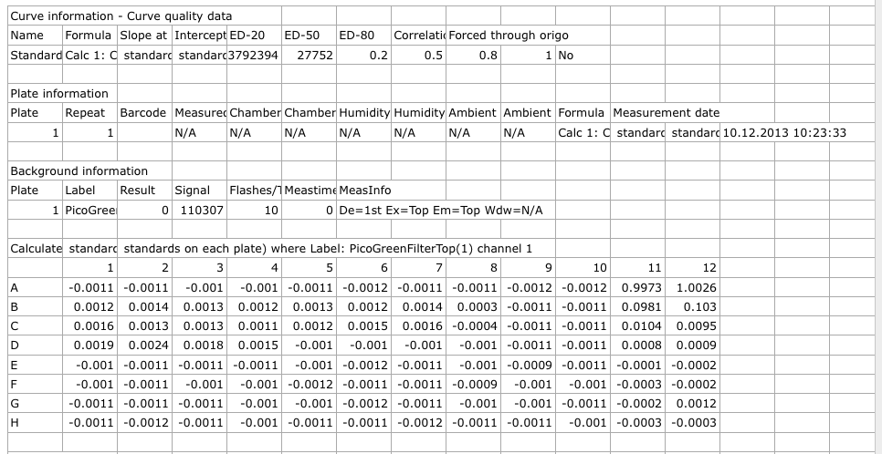
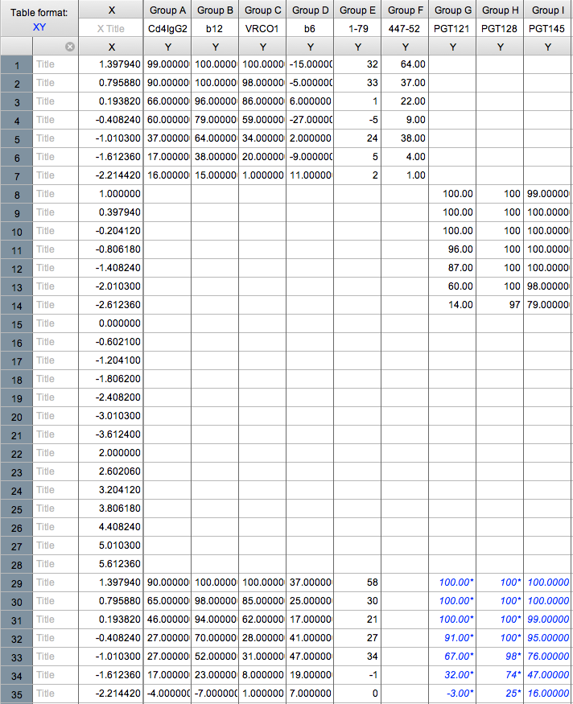
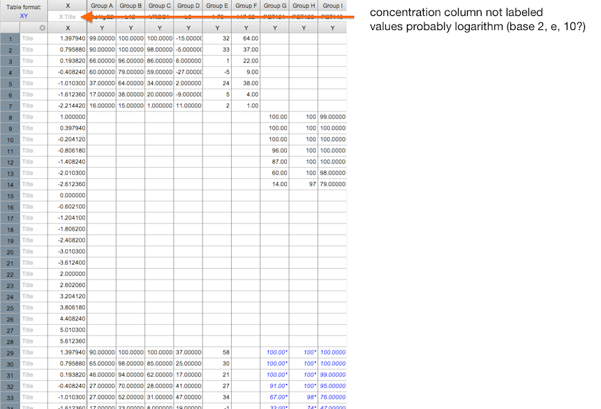
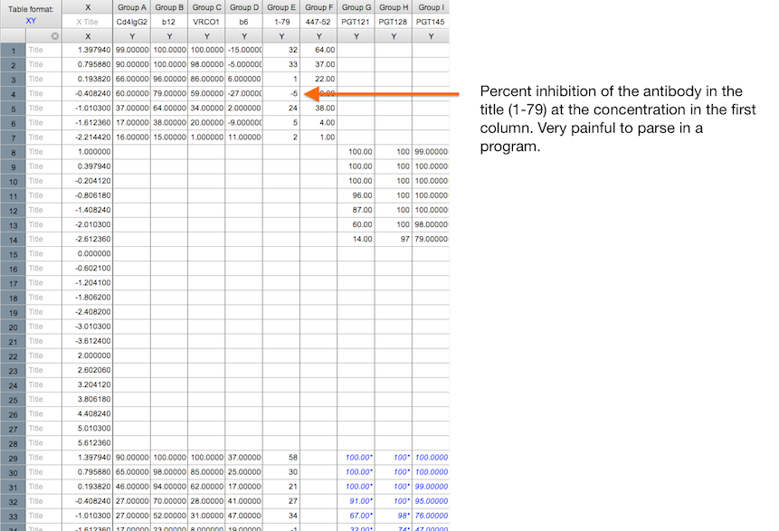
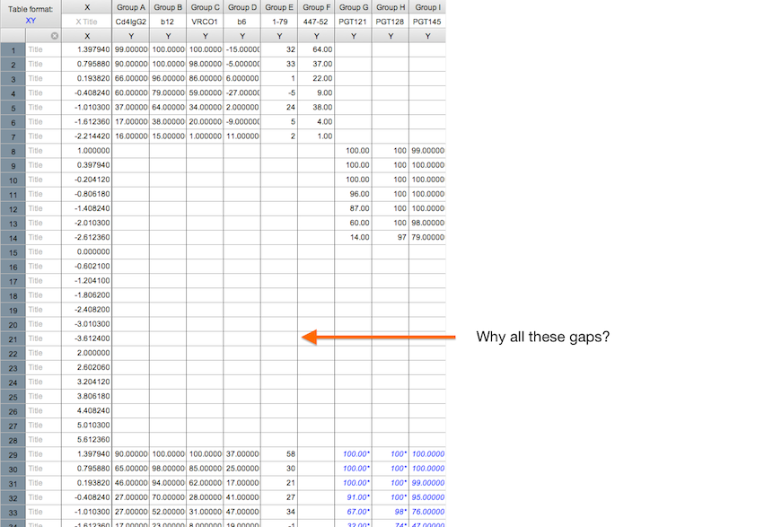
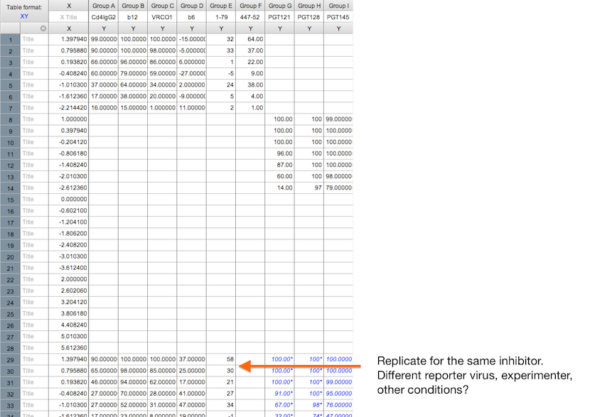
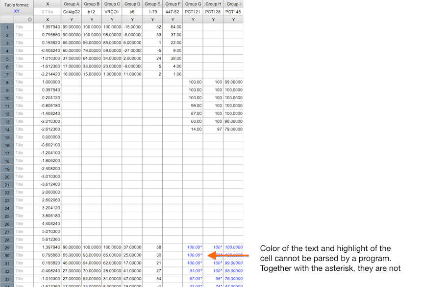

```{r setup, echo=FALSE}
messy_personal = data.frame(id=c(25, 64), dob=c('1979-01-16', '20 sep 1984'),
                            male=c('yes', ''), female=c('', 'y'))

messy_results = data.frame(id=c(25, 64), HIV=c(3100, 0),
                           HCV=c(45000, 85000))

tidy_personal = data.frame(id=c(25, 64),
                           date_of_birth=c('1979-01-16', '1984-09-20'),
                           sex=c('M', 'F'))

tidy_results = data.frame(id=c(25, 25, 64, 64),
                          test=rep(c('HIV', 'HCV'), 2),
                          viral_load=c(3100, 45000, 0, 85000))

JRCSF_all_excerpt <-
  read.csv("~/Dropbox/Documents/Talks/DataSharingPolicy/JRCSF_all_excerpt.csv")
```

# Introduction

Adaptation of
[How to share data with a statistician](https://github.com/jtleek/datasharing)
by Jeff Leek

Available on [GitHub](https://github.com/ozagordi/DataSharingPolicy)

---

## Why prescribe how to share data

**Chiefly, because it takes more time to make sense of messy data.**

Moreover:

1. Reduces errors and iterations (and more iterations means more time)
2. Improves reproducibility (should your analysis be questioned)
3. Helps communicating

--- &vcenter

## ..and above all

### It makes the life of the statistician much easier

---

## What you should deliver and why

1. The raw data: because it's the most trustable source.
2. A tidy data set: because it is directly processable, more on this later.
3. A code book describing each variable and its values in the tidy data set: it reduces errors, helps understanding, enforces reproducibility.
4. An **explicit** and **exact** recipe you used to go from 1 -> 2,3

---

## The raw data

Examples:

1. FACS output (the `.fcs` file, before using Flowjow or anything else).
2. The `.csv` or `.txt` file from the plate reader (**before** loading into Excel).
3. Microscopy `.tiff` images.
4. NGS sequences in `.fastq` format

---

## Example of raw data: file from the plate reader

As we will see, this is an example of _messy_ data.



---

## Raw means:

1. No software analysis
2. No manipulation/removal of data
3. Data were not summarised

If manipulated data is reported as raw, the statistician has to perform an
autopsy to find out what went wrong.

Autopsies are

> as fun as being hit by a (large) truck, with the downside of
> not being a fast process.

---

## Tidy data set: why

Tidy data are easy to clean and analyse.

There is no need to reinvent the wheel for each new dataset.

> The development of tidy data has been driven by my struggles working with
> real-world datasets, which are often organised in bizarre ways. I have spent
> countless hours struggling to get these datasets organised in a way that
> makes data analysis possible, let alone easy. (Hadley Wickham)

#### Tidy datasets are not _pretty_ datasets. They are not meant to be visualised.

--- 

## Tidy data set

A tidy data set follows two fundamental principles:

1. Measured variables on the columns
2. Single observations of the variables on the rows
3. Different tables for different types of variables

On point 3: (**no** Excel Worksheets) and use unique identifiers to link
different tables.

--- &twocol w1:50% w2:50%

## Toy example: patient features

The `id` column identifies the patient and will be used to link with
the next tables.

*** left

#### Messy
```{r dob_messy, echo=FALSE}
messy_personal
```

Variables are listed on the columns rather than on the row. Dates and sex are
reported inconsistently.

*** right

#### Tidy
```{r dob_tidy, echo=FALSE}
tidy_personal
```

Dates are reported in a consistent format `YYYY-MM-YY`, sex is now a variable
(reported on the column) and reported consistently (initial, capitalised).

--- &twocol w1:50% w2:50%

## Toy example: virology diagnosis
This table reports results of some virology tests. The `id` column identifies
the patient so it can be used to link the previous table.

*** left

#### Messy
```{r res_messy, echo=FALSE}
messy_results
```
The analysts would need to adapt their tool if, say, another test were added.

*** right

#### Tidy
```{r res_tidy, echo=FALSE}
tidy_results
```
Easier to parse and analyse.

---

## Excerpt of "JRCSF all.pzf""



---

## Excerpt of "JRCSF all.pzf""



---

## Excerpt of "JRCSF all.pzf""



---

## Excerpt of "JRCSF all.pzf""



---

## Excerpt of "JRCSF all.pzf""



---

## Excerpt of "JRCSF all.pzf""



